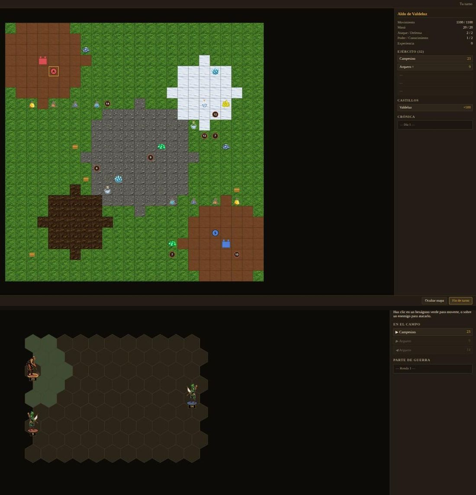
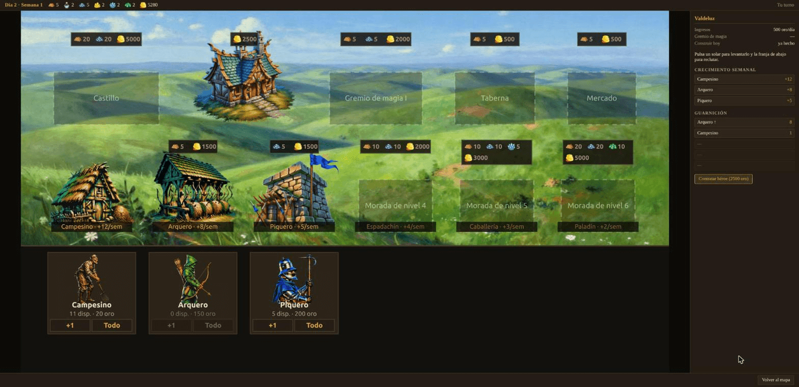

# Heroes of Silence

Un juego de estrategia por turnos en el navegador, al estilo de *Heroes of Might
and Magic 2*, construido como banco de pruebas para tres ideas:

- los **NPCs los lleva un agente** conectado por MCP, no un árbol de decisión;
- los **mapas los diseña ese mismo agente**, que devuelve un plan declarativo en
  vez de dibujar nada;
- **todo el arte está generado con IA** — terrenos, criaturas, iconos y las
  animaciones de combate.

El juego es el andamio. Lo interesante es lo que se puede enchufar dentro.



## Qué hay hecho

**Juego completo y jugable.** Mapa de aventura con niebla de guerra, recogida de
recursos, minas, castillos con construcción y reclutamiento, héroes con ejército
de cinco unidades, y batalla táctica en rejilla hexagonal de 11×9 con
contraataques, tiradores, moral, suerte y hechizos. Una partida termina con un
ganador.

**El castillo es una pantalla, no un menú.** Once solares fijos, cada uno con su
cadena de mejora: se pulsa el solar y se levanta lo siguiente. Un solar vacío se
dibuja como parcela punteada con el nombre de lo que iría ahí, así que se ve a la
vez lo que tienes y lo que te falta, y debajo de cada morada está su casilla de
reclutamiento.



Las constantes vienen del código de [fheroes2](https://github.com/ihhub/fheroes2),
no de la memoria: 5 slots de ejército, 7 recursos, puntos de movimiento marcados
por la criatura más lenta del ejército, puntos de hechizo = 10 × Conocimiento.

**Un agente puede jugar.** Se conecta por MCP y recibe el turno con el estado y
el formato de respuesta en el mismo mensaje. Si no hay agente conectado, juega
una IA de reglas y la partida sigue igual.

**Y se le puede ver jugar.** `pnpm mirar` abre una página de solo lectura que
enseña la partida del servidor: el mapa, las banderas, el día, la crónica y —esto
es lo que importa— **las batallas acción a acción**, que son la mayoría de las
decisiones que toma el agente. También lo que va pensando: el `reasoning` que
manda con cada turno sale ahí, escapado como todo lo demás.

**El arte se genera.** 140 imágenes con [fal.ai](https://fal.ai) por 3,74 $,
incluidas 72 poses de animación y los edificios de las dos facciones. Cada
criatura se anima con **una sola llamada**: las seis poses viajan en el mismo
atlas, que es lo que mantiene al personaje reconocible entre fotogramas.

## Arrancar

```bash
pnpm install
pnpm dev      # http://localhost:3100 — la partida local contra la IA de reglas
pnpm test
```

Para que juegue un agente hacen falta dos terminales:

```bash
pnpm partida                      # terminal 1: la partida
# terminal 2: Claude Code en esta carpeta. El MCP "heroes" ya está en .mcp.json.
#   «juega la partida: llama a heroes_listen, decide, responde con
#    heroes_respond, y repite»
```

Y una tercera terminal para **mirar** esa partida mientras se juega:

```bash
pnpm mirar                        # abre http://localhost:3100/espectador/
```

El espectador es de **solo lectura**: no manda ni una acción, solo escucha el
canal del servidor y pinta. Se conecta a `ws://localhost:9880`, que es lo que
mueve `HEROES_SPECTATOR_PORT`; si el servidor arrancó con `0` —para que el puerto
lo elija el sistema— la página lo dice y te manda a
`/espectador/?puerto=NNNN`, con el número que imprime `pnpm partida`.

Y para comprobar el circuito entero sin tocar nada a mano:

```bash
pnpm qa
```

## Generar el arte

Hace falta una clave de [fal.ai](https://fal.ai) en `.env`:

```bash
echo 'FAL_KEY=tu-clave' > .env

pnpm gen                                    # simula: qué falta y qué costaría
pnpm gen -- all --go --budget 4             # terrenos, criaturas, iconos y edificios
npx tsx tools/gen/animate.ts --all --go     # las poses de combate
```

Sin `--go` no se gasta un céntimo. La caché va por hash del payload, así que
repetir una tanda sale gratis. `--budget` es el tope del gasto **acumulado** del
proyecto, no el de la tanda.

## Cómo está montado

```
src/core/      las reglas. TypeScript puro: sin DOM y sin node:*
src/server/    bridge WebSocket + puente MCP para el agente
src/client/    Vite + Canvas 2D. Una escena por pantalla; solo pinta
               espectador/ es la página que mira la partida del servidor
tools/gen/     generación de assets con fal.ai
data/          criaturas, edificios y hechizos en JSON editable
```

La frontera que no se cruza: **la lógica vive en `core` y el cliente solo
pinta**. Y toda tirada de dados pasa por un generador con semilla, así que una
partida es reproducible y los tests no son una lotería.

Más detalle en [`CLAUDE.md`](CLAUDE.md).

## Sobre el original

Los datos del *Heroes of Might and Magic 2* original son propiedad de Ubisoft y
**no se usan aquí**: ni un sprite, ni un sonido, ni un `.AGG`. Lo que se
reimplementa son las reglas —que no son objeto de copyright, y por eso existen
fheroes2 y VCMI— y todo el arte está generado. De ahí también el nombre.

## Licencia

MIT.
